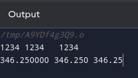

## Write a program to print int and real numbers

```C
#include <stdio.h>

main(){
    int i=1 2 3 4;
    float x=346.25;

    printf("%2d %4d %6d \n", i, i, i);
    printf("%f %7f %7.2f", x, x, x);
}
```

- %nd means that the integer i will be printed with a minimum field width of 'n' characters. If the number is less than 'n' digits, it will be padded with spaces on the left. If it's more than 'n' digits, it will be printed as is. (n=2,4,6 in the above case)

